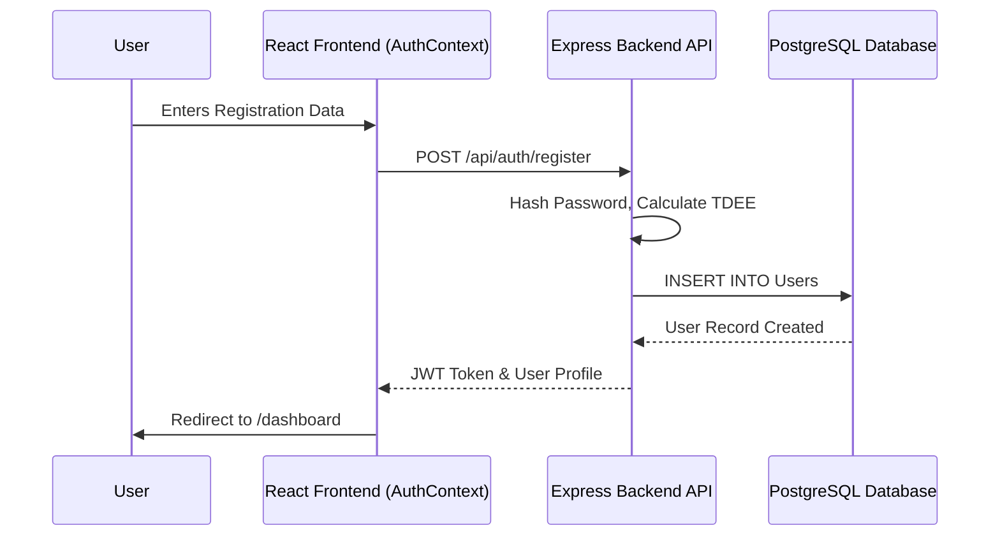

# Data Flow Diagrams and User Stories

## Epic 1: User Identity and Profile Management

### User Stories
*   **As an unregistered user**, I want to create an account by providing my email and personal metrics, so that the app can calculate my personalized caloric needs.
*   **As a registered user**, I want to log in securely, so that my diet data remains private.
*   **As a registered user**, I want to update my weight and goals in my profile, so that the app recalculates my required macros as my body changes.

### Data Flow: Authentication & Profile


---

## Epic 2: Meal Tracking & Daily Dashboard

### User Stories
*   **As a user**, I want to view a dashboard that shows my daily consumed vs. remaining calories, so that I can make informed eating decisions for the rest of the day.
*   **As a user**, I want to search a database for foods and log them to my daily diary.
*   **As a user**, I want to save a combination of foods as a "Custom Meal" so I can log it instantly in the future.

### Data Flow: Meal Logging
```mermaid
sequenceDiagram
    participant User
    participant React Frontend
    participant Express Backend API
    participant Third-Party API (e.g., Edamam)
    participant PostgreSQL Database
    
    User->>React Frontend: Searches for "Apple"
    React Frontend->>Express Backend API: GET /api/foods/search?q=Apple
    Express Backend API->>Third-Party API (e.g., Edamam): Search Query
    Third-Party API (e.g., Edamam)-->>Express Backend API: Food Data (Calories, Macros)
    Express Backend API-->>React Frontend: JSON Results
    User->>React Frontend: Selects "Apple" (1 Medium) and Logs
    React Frontend->>Express Backend API: POST /api/logs/daily
    Express Backend API->>PostgreSQL Database: INSERT INTO DailyLogs
    PostgreSQL Database-->>Express Backend API: Success
    Express Backend API-->>React Frontend: Updated Daily Totals
    React Frontend->>User: Dashboard Rings Update Visually
```